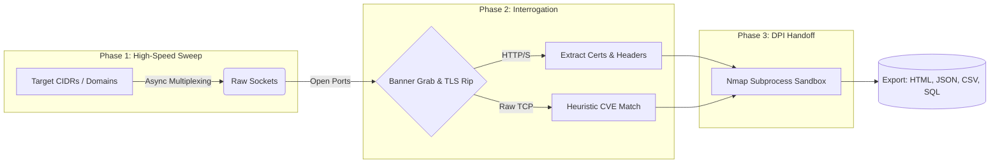

  <!-- PLACEHOLDER: Create a sleek 1000x300 banner image with your logo -->
  

  <h1>⚡ OmniScan Titan</h1>
  
<b>High-Performance, Asynchronous Network Intelligence & Vulnerability Mapping Framework</b>

  

    
    
    
  

 

> **Note:** In modern network engagements, speed and stealth are everything. Traditional scanners are bloated, slow, and often trip alarms before reconnaissance is even complete. **OmniScan Titan** was engineered to solve this.

Built from the ground up on Python's `asyncio` event loop, Titan utilizes multiplexed socket connections to sweep vast digital footprints in seconds. Once the perimeter is mapped, it seamlessly hands off active ports to a sandboxed Nmap subprocess, ensuring deep-packet inspection only occurs exactly where it matters.

---

## 👁️ Live Telemetry in Action

<!-- PLACEHOLDER: Record a high-quality GIF of your tool running. Use a tool like 'vhs' by Charmbracelet or 'Terminalizer' to make it look incredibly smooth and professional. -->

  
  
<i>Titan sweeping a /24 subnet and dynamically passing targets to the DPI engine.</i>

---

## 🏗️ The 3-Phase Architecture

Unlike legacy synchronous scanners that wait for timeouts, Titan operates on a non-blocking asynchronous matrix.

### 1️⃣ Discovery Phase
Thousands of lightweight async workers fire parallel connection requests to the target pool, maximizing your OS's file descriptor limits (up to 65,000 concurrent sockets).

### 2️⃣ Interrogation Phase
Active sockets attempt smart banner grabbing. If HTTPS is detected, it auto-negotiates SSL/TLS to rip the underlying certificate data, identifies WAFs (Cloudflare, Imperva), and extracts server headers.

### 3️⃣ Handoff Phase
Confirmed active ports are securely batched and passed via temporary file descriptors to the Nmap engine for secondary, deep-packet validation without wasting time scanning closed ports.

---

## 🦅 Tactical Capabilities

* ⚡ **Asynchronous Multiplexing:** Capable of sweeping tens of thousands of ports concurrently without exhausting operating system file descriptors.
* 🧠 **Hybrid Inspection Engine (HIE):** Connects raw socket discovery with Nmap's Deep Packet Inspection. Find the open doors instantly, then interrogate them thoroughly.
* 🎯 **Heuristic Fingerprinting:** Instantly flags critically outdated software and known CVEs (e.g., outdated OpenSSH, Apache path traversal, Mod_copy RCE) directly from raw banners.
* 🛡️ **Context-Aware Protocol Analysis:** Distinguishes between HTTP, HTTPS, and raw TCP. Automatically extracts SSL certificate common names, HTTP server headers, and detects active Web Application Firewalls.
* 📊 **Real-Time Telemetry:** A Rich-powered terminal interface providing live, color-coded intelligence routing and statistical analysis as the scan progresses.
